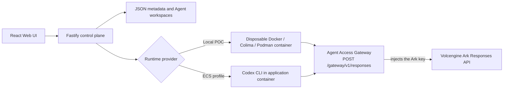

# Volc Agent Launchpad

**A CodeJam Track #5 entry.** The Starter Kit gave us an Agent platform: create
an Agent in a browser, send it a task, and Codex CLI runs it inside a disposable
container against the Volcengine Ark Responses API. What the Starter Kit
deliberately left out is the middleware. This is our middleware.

The baseline routed the Agent Runtime **directly to Ark**, which required the
Ark API key to live inside a container that runs arbitrary shell commands. We
replaced that path with the **Agent Access Gateway**. The agent now holds only a
short-lived, revocable, permission-free run credential and knows exactly one
endpoint. Every model and tool call it makes is authenticated against a live run
session, authorized against its owner's current role intersected with the
Agent's delegated grants and the resource's visibility, checked against the
owner's token budget, and recorded — all before the real credential is attached
server-side and the call is forwarded.

Because permissions live in the store rather than in the token, revoking an
agent, demoting a human, or cutting a budget takes effect on the **very next
call** — including mid-run.

> [!WARNING]
> This is a proof of concept. Its users are seeded and its switcher is mock
> authentication, not a login; there is no tracing and no hardened sandbox
> beyond the container baseline. Authorization and the gateway audit trail are
> real and server-side, but the store is single-process. Do not use production
> data or credentials. See [SECURITY.md](SECURITY.md).

## What we built

Every check below runs server-side, before anything is forwarded. A refused call
reaches no upstream and costs nothing.

- **The Agent Access Gateway** — the single endpoint an Agent may call. It
  verifies the run credential against a live session, and anything unverifiable
  is a `401` with no upstream request.
  [ADR](docs/adr/2026-08-27-agent-access-gateway.md)
- **Per-call authorization from stored policy.** Effective authority is
  `owner role ∩ Agent grants ∩ resource visibility`, resolved on every call.
  Permissions are never in the credential, so nothing has to expire for a
  policy change to bite.
- **Delegated tool grants** that narrow an owner's role and can never elevate
  it — editable during a Run.
  [ADR](docs/adr/2026-08-31-agent-tool-delegation.md)
- **Invisible documents.** A document you may not read answers
  `404 Document not found`, byte-identical to what an id that does not exist
  returns, while the audit trail records the true ownership reason.
  [ADR](docs/adr/2026-08-30-invisible-documents.md)
- **A per-owner token budget** enforced before the model call is made, not
  after it is billed — counting in-flight spend, so a Run that is looping right
  now can still be stopped.
- **An audit trail** of one redacted record per decision, written _before_ the
  agent is answered. No request or response body is ever stored.
  [ADR](docs/adr/2026-08-31-audit-sidecar-and-retention.md)
- **Operator recovery levers** — revoke a credential, change a role, cut a
  budget, reset spend — all landing on the Agent's next gateway call.

The one-page trust-boundary diagram is
[docs/ARCHITECTURE_DIAGRAM.md](docs/ARCHITECTURE_DIAGRAM.md).

## What the Starter Kit provided

Drawing the line honestly, because none of this is ours: Agent CRUD and
lifecycle, the browser Playground and its polling, JSON persistence, per-Agent
workspaces, Codex CLI execution with thread resumption, the disposable Runtime
container, and the Docker and Terraform deployment paths. All of it still works
— keeping the baseline intact was a constraint, not an accident.

The Starter Kit's own architecture diagram had a single empty node labelled
"Team-Designed Middleware," with dotted arrows into three seams. Everything in
[What we built](#what-we-built) is that node filled in, and all three seams are
genuinely used.

## Screenshots

### Agent Playground


### Create an Agent


## Quickstart

You need Node.js 22+, npm 10+, one of Docker / Colima / Podman, and a
Volcengine Ark API key with a Responses-capable endpoint. Codex CLI ships inside
the Runtime image; you do not install it.

```bash
git clone <repository-url> volc-agent-launchpad
cd volc-agent-launchpad

ARK_API_KEY=your-ark-api-key \
ARK_MODEL=ep-your-endpoint-id \
npm run poc
```

Or put `ARK_API_KEY` and `ARK_MODEL` in `.env` and run `npm run poc` alone. Only
the credentials are read from `.env` — the POC sets its own runtime
configuration and ignores the Compose values for `HOST`, `RUNTIME_PROVIDER`, and
the state directories.

The first run installs dependencies and builds the Runtime image, selecting
Docker, Colima, or Podman automatically. Then open <http://localhost:3000>.

**The browser will ask for an access token.** The POC listens on every
interface, because the Runtime container reaches the gateway through the
container host alias, which never lands on the host loopback interface — and
listening beyond loopback requires the shared browser token. So when you have
not configured one, the startup script mints an ephemeral `APP_AUTH_TOKEN` for
the run and prints it to the terminal:

```text
[local-poc] Open http://localhost:3000
[local-poc] This run generated a browser access token because the server listens
[local-poc] beyond loopback. Paste it into the unlock screen, and set your own
[local-poc] APP_AUTH_TOKEN in .env to skip this:
[local-poc]   <the token>
```

Copy that value into the unlock screen and you are in. Those lines go to
standard error just before the server starts logging, so scroll back if request
logs have already filled the terminal.

**If nothing is printed, that is expected**: the script only mints and announces
a token when it had to invent one. Setting your own `APP_AUTH_TOKEN` (24+ random
characters) in `.env` skips both the minting and the message — use that value at
the unlock screen. Either way it is a shared demo token, not a login: it gates
the demo, and the authorization this project is about happens elsewhere, per
call.

**Windows.** `npm run poc` works from PowerShell, Command Prompt, or Windows
Terminal — npm runs package scripts through `cmd.exe` either way. What is
required is **Git for Windows**, whose Git Bash runs the POC script; it is
located automatically and WSL bash is not used. Put the credentials in `.env`,
since PowerShell has no `VAR=value command` form. State lives in `.local/`.

**Stopping.** `Ctrl+C` removes temporary Runtime containers but keeps Agent
workspaces and conversations. State lives in `~/.volc-agent-launchpad/` on
macOS, `.local/` on Linux, or wherever `LOCAL_POC_DATA_ROOT` points. Run
`npm run poc` again to continue.

## Demo: make the gateway deny something

### First, a normal Run

1. In the sidebar, use **Acting as** to pick who you are. Seeded users are User
   A (`admin`) and User B (`basic`). The choice persists across reloads and
   decides who owns the Agents you create.
2. **Create Agent** — give it a name, a description, and workspace
   instructions.
3. Send it any task in the Playground, for example:

   ```text
   Create a TypeScript hello-world CLI, add a test, and run it.
   ```

4. Watch **Gateway evidence** fill in under the composer. Every turn goes
   through the gateway's model proxy, so you get an `allow` row for `model`
   without doing anything special — that row is proof the Agent reached Ark
   through us, holding no Ark key of its own.

### Then break it on purpose

These three need no extra setup, because they act on the model path every Run
already uses:

- **Suspend a human.** In the **Operator Console**, set a user's role to
  `suspended`. Their Agent's next turn is refused the **model itself**, not
  merely a tool — `403`, one deny row, no upstream call. Nothing was reissued
  and nothing expired.
- **Cut a budget.** Set that human's **token budget** to something below what
  they have already spent. The next model call is a `402` before any request
  leaves the server. Note that `0` means _unlimited_, not zero allowance — use a
  small positive number.
- **Pull the credential.** Hit **Revoke** on a live session. The Agent's next
  gateway call dies mid-run with a `401`.

### Tool and document denials

Create an Agent as **User B** (`basic`) and send it the **first starter
prompt** — "Fetch document `doc-a1` through the gateway, then search, then try
the payments tool."

No setup is needed: the Runtime is given the gateway's tool origin in
`LAUNCHPAD_GATEWAY_URL` alongside its `RUN_JWT` credential, and the default
workspace instructions describe the three tool routes and the seeded document
ids. Keep the default instructions, or edit them — they are ordinary Agent
instructions, and the gateway authorizes every call either way.

Four things happen, all decided server-side:

- **Tool denied by role.** `payments` is not in the `basic` role: `403`, one
  deny row, and the tool service is never reached.
- **Document made invisible.** `doc-a1` belongs to User A and is private, so
  User B's Agent gets `404 Document not found` — byte-identical to asking for an
  id that does not exist. The audit row records the real ownership reason, which
  is the point: the Agent learns nothing, the operator learns everything.
- **Search scoped, not denied.** `search` returns the three public `kb-*`
  documents and silently omits User A's private ones. One `allow` row, because
  no per-row decision was made — which is why the Operator Console shows the
  ground-truth document table beside the feed.
- **Policy changed mid-run.** With a Run live, open **Settings → Delegated
  gateway tools**, uncheck a tool, and hit **Apply tool grants**. The next call
  on the same unexpired credential is denied. Restore it and it succeeds again.
  Granting `payments` to a basic owner's Agent still denies it — the owner's
  role is the ceiling, and a grant can only narrow.

The Operator Console shows all of it across every Agent and Run, beside the
sessions, documents, and roles behind it. Like the evidence panel, it decides
nothing — it asks the server and displays what the server says.

## How it works



Codex never holds the Ark key: it calls the gateway with a run credential, and
the gateway attaches the real key on the way upstream, streaming the reply back
unmodified. A Run's decision trail is readable at `GET /api/runs/:id/audit`.

The first turn uses `codex exec`; later turns resume the stored Codex thread.
Deleting an Agent archives its workspace under `workspaces/.deleted/`.

For component and extension boundaries, see
[docs/ARCHITECTURE.md](docs/ARCHITECTURE.md). For trust boundaries and the
numbered enforcement points, see
[docs/ARCHITECTURE_DIAGRAM.md](docs/ARCHITECTURE_DIAGRAM.md).

## Other ways to run it

### Docker Compose

```bash
./scripts/bootstrap-local.sh
```

Required values in `.env`:

```dotenv
ARK_API_KEY=your-ark-api-key
ARK_MODEL=ep-your-endpoint-id
APP_AUTH_TOKEN=replace-with-at-least-24-random-characters
GATEWAY_JWT_SECRET=replace-with-at-least-16-random-characters
```

Then `docker compose up --build` and open <http://localhost:3000>.
`docker compose down` stops it without deleting Agent data.

### Development with hot reload

```bash
npm install
cp .env.example .env
npm install --global @openai/codex@0.111.0
export GATEWAY_JWT_SECRET="$(node -e \
  "console.log(require('node:crypto').randomBytes(32).toString('base64url'))")"
npm run dev
```

`npm run dev` reads the process environment rather than `.env`, and the server
refuses to start without `GATEWAY_JWT_SECRET` — the gateway verifies every agent
call against it. Export `ARK_API_KEY` and `ARK_MODEL` the same way to run real
tasks. Web UI on <http://localhost:5173>, API on <http://localhost:3000>. Use
local paths in `.env` when running outside Docker:

```dotenv
APP_DATA_DIR=.data
AGENT_WORKSPACE_ROOT=workspaces
CODEX_HOME=codex-home
```

### Choosing a container engine

Force Podman when multiple engines are installed:

```bash
CONTAINER_ENGINE=podman \
ARK_API_KEY=your-ark-api-key \
ARK_MODEL=ep-your-endpoint-id \
npm run poc
```

Colima uses `CONTAINER_ENGINE=docker` because it exposes the Docker CLI. For a
clean Linux host, follow the
[rootless Podman setup](docs/LOCAL_POC.md#rootless-podman-on-linux).

## Configuration

| Variable                  | Default               | Purpose                                                                                                                                                                                       |
| ------------------------- | --------------------- | --------------------------------------------------------------------------------------------------------------------------------------------------------------------------------------------- |
| `ARK_API_KEY`             | Required              | Ark model API key.                                                                                                                                                                            |
| `ARK_MODEL`               | Required              | Responses-capable endpoint or model ID.                                                                                                                                                       |
| `ARK_BASE_URL`            | Beijing v3 endpoint   | Ark OpenAI-compatible API URL.                                                                                                                                                                |
| `APP_AUTH_TOKEN`          | Empty on loopback     | Shared demo token; required beyond loopback, including `npm run poc`. Use 24+ random characters.                                                                                              |
| `GATEWAY_JWT_SECRET`      | Required              | Signs each run's gateway credential. 16+ characters; startup fails without it. `npm run poc` mints an ephemeral one.                                                                          |
| `GATEWAY_TOOL_CREDENTIAL` | Generated per process | What the gateway presents to the mock tool service, so a tool cannot be reached without passing the authorization check. Optional: set it only to pin the value, using 16+ random characters. |
| `RUNTIME_PROVIDER`        | `local-process`       | `container` for disposable local Runtime containers.                                                                                                                                          |
| `CODEX_SANDBOX_MODE`      | `workspace-write`     | Codex inner sandbox mode.                                                                                                                                                                     |
| `CODEX_TIMEOUT_MS`        | `600000`              | Maximum duration of one turn.                                                                                                                                                                 |
| `SESSION_TTL_MS`          | `660000`              | How long a run's gateway credential stays usable. Revocation is immediate and does not wait for it.                                                                                           |
| `AUDIT_RETENTION_LIMIT`   | `1000`                | How many gateway decisions the audit trail keeps, newest first. Bounds how long a record is kept, never whether it is written. Minimum 10.                                                    |
| `LOCAL_POC_DATA_ROOT`     | Platform-specific     | Local metadata, workspace, and session directory.                                                                                                                                             |

See [.env.example](.env.example) for all Runtime and resource-limit options.

## Deployment

Local is the default and the judged path. ECS is optional.

- [Existing Linux ECS with Docker](docs/DEPLOYMENT.md#existing-linux-ecs)
- [Complete Volcengine environment with Terraform](docs/DEPLOYMENT.md#terraform-deployment)
- [Local Docker, Colima, and Podman details](docs/LOCAL_POC.md)

The existing-ECS script deploys from the current source tree:

```bash
cp .env.example .env.production
./scripts/deploy-existing-ecs.sh .env.production
```

The Terraform path provisions VPC, subnet, security group, ECS, and EIP:

```bash
cp deploy/volcengine/terraform.tfvars.example \
  deploy/volcengine/terraform.tfvars
./scripts/deploy-volcengine.sh
```

## Tests and validation

```bash
npm run check      # lint + format + typecheck + test + build — the gate CI runs
npm run test       # Vitest alone (309 tests across 14 files)
```

Optional, for the deployment paths:

```bash
terraform fmt -check -recursive deploy/volcengine
docker compose config
```

The suite tests the middleware's **behavior**, not its rendering — a denial that
is actually denied, a budget that actually stops a Run:

| Suite                                                    | What it holds down                                                                                                                               |
| -------------------------------------------------------- | ------------------------------------------------------------------------------------------------------------------------------------------------ |
| `gateway.test.ts`                                        | Every denial path, and that the upstream was **not** called on each one                                                                          |
| `authz.test.ts`                                          | `can()` across the whole role × grant × visibility matrix                                                                                        |
| `budget.test.ts`                                         | Settled plus in-flight spend against the ceiling                                                                                                 |
| `audit.test.ts`                                          | One record per decision, redacted, written before the answer                                                                                     |
| `mock-tools.test.ts`                                     | Scope re-derived downstream; a call without the gateway credential is refused                                                                    |
| `run-jwt.test.ts`, `timing-safe.test.ts`                 | Signature, algorithm, and expiry verification                                                                                                    |
| `codex-runner.test.ts`, `container-codex-runner.test.ts` | That `ARK_API_KEY` never reaches a runner environment, argv, or `config.toml`, and that the tool origin does — with each engine's own host alias |
| `store.test.ts`                                          | Audit appends do not rewrite `db.json`; migration and torn-line recovery                                                                         |

The two runner suites and the invisible-document comparison in `gateway.test.ts`
exist specifically to fail if someone reintroduces the vulnerability this
project removed.

## Known limitations

Honest scope boundaries, not bugs. [SECURITY.md](SECURITY.md) has the full list.

- **Authentication is mocked.** Users are seeded and the switcher is a dev
  affordance, not a login. Authorization is the middleware being demonstrated;
  authentication deliberately is not.
- **The store is single-process.** `JsonStore` serializes its own writes and
  atomically replaces one file. Concurrent writers would corrupt it.
- **Operator actions are not audited.** An `AuditRecord` belongs to a Run, and a
  role change or a revocation has none. The change is visible only in its effect
  on the next decision.
- **Audit retention is a rolling window.** The newest `AUDIT_RETENTION_LIMIT`
  records are kept, oldest evicted first. A long-lived deployment would need an
  export this POC does not have.
- **In-flight spend is estimated**, not measured — reading real per-call usage
  would mean parsing the stream the gateway forwards untouched. Settled spend is
  exact, and the console shows the two figures separately rather than as one
  total.
- **The container is not a hardened multi-tenant boundary.** CPU, memory, and
  PID limits, dropped capabilities, and `no-new-privileges` are baseline
  safeguards, not tenant isolation.
- **There is no tracing.** Pino request logging is the Starter Kit's baseline;
  we added an audit trail of decisions, which is a different thing and does not
  claim to be a correlated trace.

## Documentation

- [Architecture](docs/ARCHITECTURE.md) — components and extension boundaries
- [Architecture diagram](docs/ARCHITECTURE_DIAGRAM.md) — trust boundaries and
  enforcement points on one page
- [Decision records](docs/adr/) — what we chose and why
- [Local POC](docs/LOCAL_POC.md) — container engines and troubleshooting
- [Deployment](docs/DEPLOYMENT.md)
- [Security policy](SECURITY.md) — including known limitations
- [Hackathon brief](docs/HACKATHON_BRIEF.md) — the organizers' final brief
- [Contributing](CONTRIBUTING.md)

## License

[MIT](LICENSE)
