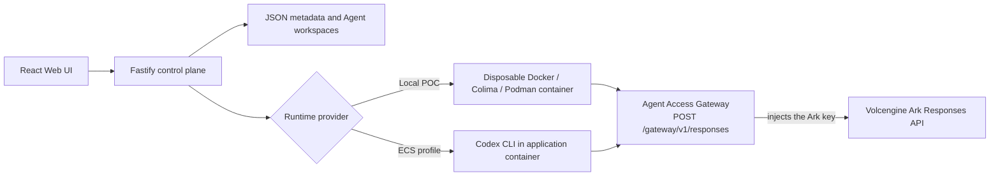

# Volc Agent Launchpad

A minimal Agent platform for three-day middleware hackathons. It provides Agent
CRUD, a browser Playground, persistent workspaces, and Codex CLI backed by the
Volcengine Ark Responses API.

Run it locally with Docker, Colima, or rootless Podman, or deploy it to
Volcengine ECS.

> [!WARNING]
> This is a proof of concept. Its users are seeded and its switcher is mock
> authentication, not a login; there is no tracing and no hardened sandbox
> beyond the container baseline. Authorization and the gateway audit trail are
> real and server-side, but the store is single-process. Do not use production
> data or credentials. See [SECURITY.md](SECURITY.md).

## Screenshots

### Agent Playground


### Create an Agent


## Features

- React and TypeScript Web UI
- Agent create, edit, start, stop, delete, and multi-turn chat
- Dev user switcher, a per-Run gateway evidence panel, and an Operator Console
  (decision feed, sessions, documents, roles) — all display-and-trigger only
- Per-Agent delegated tool grants that narrow (and never elevate) the owner's
  live role, including changes that apply on the next mid-run call
- Fastify control plane with asynchronous Run state
- Persistent Agent workspaces and Codex sessions
- Disposable Docker, Colima, or Podman container for each local turn
- Docker and Terraform deployment paths for Volcengine ECS

## Requirements

- Node.js 22+
- npm 10+
- Docker, Colima, or Podman
- A Volcengine Ark API key and endpoint that supports the Responses API

Codex CLI is included in the Runtime image and is not required on the host.

## Local browser SOP

### 1. Check the local tools

Install Node.js 22+ and one supported container engine, then verify them:

```bash
node --version
npm --version
docker --version        # Docker Desktop, Docker Engine, or Colima
podman --version        # Use this instead when running Podman
```

Only one container engine is required. Codex CLI is already included in the
Runtime image.

### 2. Clone the repository

```bash
git clone <repository-url> volc-agent-launchpad
cd volc-agent-launchpad
```

Skip this step when already working from the repository root.

### 3. Start the POC

```bash
ARK_API_KEY=your-ark-api-key \
ARK_MODEL=ep-your-endpoint-id \
npm run poc
```

Or put `ARK_API_KEY` and `ARK_MODEL` in `.env` and run `npm run poc` on its
own. Only the credentials are read from `.env`; the POC sets its own runtime
configuration and ignores the Compose values for `HOST`, `RUNTIME_PROVIDER`,
and the state directories.

The first run installs Node.js dependencies and builds the Runtime image. The
script automatically selects Docker, Colima, or Podman.

**Windows.** `npm run poc` works from PowerShell, Command Prompt, or Windows
Terminal — the terminal does not matter, because npm runs package scripts
through `cmd.exe` either way. What is required is **Git for Windows**, whose
Git Bash runs the POC script; `npm run poc` locates it automatically and does
not use WSL bash. Put the credentials in `.env`, since PowerShell cannot use
the `VAR=value command` form above. State lives in `.local/`.

The POC listens on every interface, because the Agent Runtime container reaches
the Agent Access Gateway through the container host alias, which never lands on
the host loopback interface. Listening beyond loopback requires the shared
browser token, so the script mints an ephemeral `APP_AUTH_TOKEN` for the run and
prints it when you have not configured one. Set your own `APP_AUTH_TOKEN` (24+
characters) in `.env` to skip the unlock screen prompt on every run.

### 4. Open the browser

Visit <http://localhost:3000>, or open it from the terminal:

```bash
open http://localhost:3000       # macOS
xdg-open http://localhost:3000   # Linux desktop
```

In the Web UI:

1. Pick who you are acting as in the sidebar's **Acting as** switcher. Seeded
   users are User A (`admin`) and User B (`basic`); the choice is remembered
   across reloads and decides which user owns the Agents you create.
2. Select **Create Agent**.
3. Enter a name, description, and workspace instructions.
4. Select **Create Agent** again.
5. Enter a task in the Playground, for example:

   ```text
   Create a TypeScript hello-world CLI, add a test, and run it.
   ```

The Agent can write files, run commands, and continue the same Codex session in
later messages.

Under the Playground composer, **Gateway evidence** fills in while the Run
works: one row per decision the Agent Access Gateway made on its behalf — the
tool, the resource, allow or deny, and the reason — with denials highlighted,
next to the Run's token usage. Switching to User B and asking that user's Agent
for `payments`, or for one of User A's documents, is how you see a denial. The
panel only displays what the server already enforced and recorded.

The sidebar's **Operator Console** opens the same evidence across every Agent
and Run, beside the sessions, documents, and roles behind it. Two levers live
there: **Revoke** ends a live run credential, so the Agent's next gateway call
dies mid-run; the **role** dropdown reassigns a human between `admin`, `basic`,
and `suspended`, which takes effect on that human's Agents' next call without
reissuing anything. Suspending a user is the strongest demo: their Agent is
refused the model itself, not merely a tool. The console decides nothing — it
asks the server, and shows what the server then says.

Open an Agent's **Settings** to configure **Delegated gateway tools**. Keep
**Inherit the owner role** checked for role-only behavior, or clear it and pick
an explicit subset. The choices come from the server's current role table, so a
basic owner never sees `payments` as something they could delegate. **Apply
tool grants** works during a Run: remove
`payments`, call it and observe a `403` plus one deny row; restore it and the
same unexpired credential succeeds. The owner role remains the ceiling, so
adding `payments` to a basic owner's Agent still denies it.

### 5. Stop and resume

Press `Ctrl+C` in the startup terminal. The script removes temporary Runtime
containers but keeps Agent workspaces and conversations.

- macOS state: `~/.volc-agent-launchpad/`
- Linux state: `.local/`
- Custom location: set `LOCAL_POC_DATA_ROOT`

Run the same `npm run poc` command to continue later.

### Select a specific container engine

Force Podman when multiple engines are installed:

```bash
CONTAINER_ENGINE=podman \
ARK_API_KEY=your-ark-api-key \
ARK_MODEL=ep-your-endpoint-id \
npm run poc
```

Colima uses `CONTAINER_ENGINE=docker` because it exposes the Docker CLI.

For a clean Linux host, follow the
[rootless Podman setup](docs/LOCAL_POC.md#rootless-podman-on-linux).

## Docker Compose

Create and edit the configuration:

```bash
./scripts/bootstrap-local.sh
```

Required values in `.env`:

```dotenv
ARK_API_KEY=your-ark-api-key
ARK_MODEL=ep-your-endpoint-id
APP_AUTH_TOKEN=replace-with-at-least-24-random-characters
GATEWAY_JWT_SECRET=replace-with-at-least-16-random-characters
```

Start the application:

```bash
docker compose up --build
```

Open <http://localhost:3000>. Stop it without deleting Agent data:

```bash
docker compose down
```

## Development

```bash
npm install
cp .env.example .env
npm install --global @openai/codex@0.111.0
export GATEWAY_JWT_SECRET="$(node -e \
  "console.log(require('node:crypto').randomBytes(32).toString('base64url'))")"
npm run dev
```

`npm run dev` reads the process environment rather than `.env`, and the server
refuses to start without `GATEWAY_JWT_SECRET`: the gateway verifies every agent
call against it. Export `ARK_API_KEY` and `ARK_MODEL` the same way to run real
tasks.

- Web UI: <http://localhost:5173>
- API: <http://localhost:3000>

Use local paths in `.env` when running outside Docker:

```dotenv
APP_DATA_DIR=.data
AGENT_WORKSPACE_ROOT=workspaces
CODEX_HOME=codex-home
```

## Deployment

- [Existing Linux ECS with Docker](docs/DEPLOYMENT.md#existing-linux-ecs)
- [Complete Volcengine environment with Terraform](docs/DEPLOYMENT.md#terraform-deployment)
- [Local Docker, Colima, and Podman details](docs/LOCAL_POC.md)

The existing-ECS script deploys from the current source tree:

```bash
cp .env.example .env.production
./scripts/deploy-existing-ecs.sh .env.production
```

The Terraform path provisions VPC, subnet, security group, ECS, and EIP:

```bash
cp deploy/volcengine/terraform.tfvars.example \
  deploy/volcengine/terraform.tfvars
./scripts/deploy-volcengine.sh
```

## Configuration

| Variable                  | Default               | Purpose                                                                                                                                                                                       |
| ------------------------- | --------------------- | --------------------------------------------------------------------------------------------------------------------------------------------------------------------------------------------- |
| `ARK_API_KEY`             | Required              | Ark model API key.                                                                                                                                                                            |
| `ARK_MODEL`               | Required              | Responses-capable endpoint or model ID.                                                                                                                                                       |
| `ARK_BASE_URL`            | Beijing v3 endpoint   | Ark OpenAI-compatible API URL.                                                                                                                                                                |
| `APP_AUTH_TOKEN`          | Empty on loopback     | Shared demo token; required beyond loopback, including `npm run poc`. Use 24+ random characters.                                                                                              |
| `GATEWAY_JWT_SECRET`      | Required              | Signs each run's gateway credential. 16+ characters; startup fails without it. `npm run poc` mints an ephemeral one.                                                                          |
| `GATEWAY_TOOL_CREDENTIAL` | Generated per process | What the gateway presents to the mock tool service, so a tool cannot be reached without passing the authorization check. Optional: set it only to pin the value, using 16+ random characters. |
| `RUNTIME_PROVIDER`        | `local-process`       | `container` for disposable local Runtime containers.                                                                                                                                          |
| `CODEX_SANDBOX_MODE`      | `workspace-write`     | Codex inner sandbox mode.                                                                                                                                                                     |
| `CODEX_TIMEOUT_MS`        | `600000`              | Maximum duration of one turn.                                                                                                                                                                 |
| `SESSION_TTL_MS`          | `660000`              | How long a run's gateway credential stays usable. Revocation is immediate and does not wait for it.                                                                                           |
| `AUDIT_RETENTION_LIMIT`   | `1000`                | How many gateway decisions the audit trail keeps, newest first. Bounds how long a record is kept, never whether it is written. Minimum 10.                                                    |
| `LOCAL_POC_DATA_ROOT`     | Platform-specific     | Local metadata, workspace, and session directory.                                                                                                                                             |

See [.env.example](.env.example) for all Runtime and resource-limit options.

## How it works



Codex never holds the Ark key: it calls the gateway with a run credential, and
the gateway attaches the real key on the way upstream, streaming the reply back.
Model and tool calls alike are authorized against the Agent owner's live role,
intersected with that Agent's delegated tool grants — and, for a document, the
resource's owner — before anything is forwarded, so a
`suspended` owner's Agent is refused the model as well as the tools. Every
decision, allowed or denied, is recorded before the answer is sent; a Run's
trail is readable at `GET /api/runs/:id/audit`, and the Operator Console shows
every Run's decisions beside the sessions, documents, and roles behind them.

The first turn uses `codex exec`; later turns resume the stored Codex thread.
Deleting an Agent archives its workspace under `workspaces/.deleted/`.

See [docs/ARCHITECTURE.md](docs/ARCHITECTURE.md) for component and extension
boundaries.

## Validation

```bash
npm run check
terraform fmt -check -recursive deploy/volcengine
docker compose config
```

## Documentation

- [Architecture](docs/ARCHITECTURE.md)
- [Local POC](docs/LOCAL_POC.md)
- [Deployment](docs/DEPLOYMENT.md)
- [Hackathon brief (final)](docs/HACKATHON_BRIEF.md)
- [Security policy](SECURITY.md)
- [Contributing](CONTRIBUTING.md)

## License

[MIT](LICENSE)
