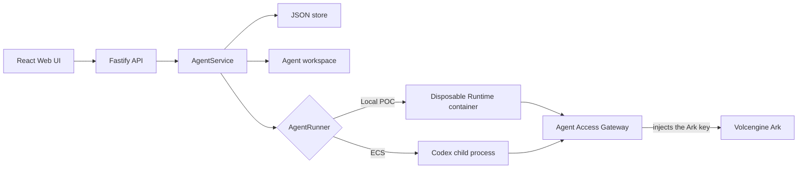

# Architecture

Volc Agent Launchpad is a single-node control plane for hackathon use.



## Components

### Web UI

Lists Agents, manages lifecycle actions, submits prompts, and polls asynchronous
Runs. It never receives the Ark API key.

It also carries the browser-side half of the gateway story, and decides none of
it. A dev user switcher names the seeded human a request acts as — sent as
`x-launchpad-user`, persisted across reloads, and validated server-side — which
is what a created Agent's `ownerId` is stamped from; each Agent is labelled with
its owner. A per-Run evidence panel in the Playground reads
`GET /api/runs/:id/audit` alongside the Run polling and renders that Run's
decisions, denials distinguished, beside its token usage. An Operator Console
reads `GET /api/operator/{audit,sessions,docs}` and shows the same evidence
across every Agent and Run, beside the run sessions (as claims — never the
credential), the documents that exist with their titles, owners, and visibility
(metadata — never content), and each human's role. Its two controls trigger
endpoints that already exist: `POST /api/agents/:id/revoke` and
`PATCH /api/users/:id`. A Documents panel is the fourth surface: it lists what
`GET /api/docs` answered for the acting human — their own documents plus every
public one, scoped server-side by the same predicate an Agent's search is scoped
by — and uploads through `POST /api/docs`, where the server generates the id,
stamps the acting human as owner, and fixes the visibility at creation. All four
surfaces are display-and-trigger only: every row they show was enforced or scoped
server-side before the browser saw it, and no lever decides anything here. The
console is deliberately not gated by the `admin` role — under mock authentication
that would be theater.

### Fastify API

Validates requests, protects remote demos with a shared bearer token, and
serves the compiled Web UI. The token is not user identity or authorization.

### Agent Access Gateway

`apps/server/src/gateway.ts` is the agent-facing half of the request boundary.
Codex is generated a `config.toml` that points at `POST /gateway/v1/responses`
instead of Ark, and reads its bearer credential from `RUN_JWT`.

That credential is verified before anything is forwarded, and fails closed. The
token must carry a valid HS256 signature (`GATEWAY_JWT_SECRET`) and an unexpired
`exp`, and the `RunSession` its `jti` names must exist, be unrevoked, still be
within its own expiry, and agree with the token about which run and Agent are
calling. Any failure is a `401` with no upstream request at all. Because the
session — not the token — is the source of truth, `POST /api/agents/:id/revoke`
stops an Agent's next call mid-run without reaching into a running container.
`SESSION_TTL_MS` decides how long a session is minted for; revocation does not
wait for it.

An authenticated call is then authorized. The gateway resolves a `Principal`
from the Agent's **current owner** in the store — permissions are deliberately
kept out of the credential, so a role change or a re-owned Agent takes effect on
the next call rather than at expiry — and applies
`can(principal, tool, resource?)` from `apps/server/src/authz.ts`. The model is
one of those tools: `POST /gateway/v1/responses` runs `can(principal, "model")`
before it forwards, which is what makes the `suspended` role (an empty grant
list) total rather than tool-only — a suspended owner's Agent cannot spend model
tokens either. Only on allow does the gateway replace the run credential with
the Ark key and forward to `${ARK_BASE_URL}/responses`, streaming the upstream
response through unmodified so server-sent events reach Codex as they arrive.
The upstream key therefore never enters an Agent Runtime.

Tool calls take `ALL /gateway/v1/tools/:tool/*` and pass through the same
verification and the same authorization step, with one addition: an
ownership-scoped tool resolves the target's `{ ownerId, visibility }` as the
resource, and `docs` is the one that does. The rule is "owned OR public",
expressed once as `visibleTo()` in `authz.ts`. Only on allow does the gateway
attach `GATEWAY_TOOL_CREDENTIAL` — plus the principal's owner id in
`x-launchpad-scope` — and forward to the mock tool service in
`apps/server/src/mock-tools.ts`. A denial is a `403` and the tool is never
reached, and because the tool service refuses anything without that credential,
the check cannot be walked around by calling it directly.

Two refinements follow from documents being user data whose _existence_ is also
user data. A `docs` ownership denial answers `404 { error: "Document not
found" }`, byte-identical to an unknown id, so an Agent enumerating ids meets a
uniform wall rather than a one-bit oracle; the audit row still carries the real
ownership reason
([ADR](adr/2026-08-30-invisible-documents.md)). And `search` is scoped rather
than denied: the tool service filters the stored documents with the same
imported `visibleTo` against the header the gateway sent, and refuses a call
carrying no scope — the gateway is its only caller and always decides one. The
gateway never parses the response bytes, so it never learns which rows were
excluded.

Whichever route was taken and whichever way it went, the gateway files exactly
one record through `AuditLog` in `apps/server/src/audit.ts` **before** it
answers: a forward is an `allow`, any refusal that reached a decision is a
`deny` carrying the reason the caller was given. Identity comes from the
resolved `Principal`, or from the stored `RunSession` when the call was refused
before one could be resolved — never from the claims of a credential the
gateway has just declined to trust, which is why a forged token naming no known
session is denied and logged but files no record. Records hold the tool, the
`resource` identifier, and the reason; no request or response body is stored,
and both text fields are masked and length-bounded on the way to the store. The
operator reads a Run's trail at `GET /api/runs/:id/audit`, and every Run's at
`GET /api/operator/audit`. Operator actions themselves — assigning a role,
revoking a session — are not audited: a record belongs to a Run, and they have
none (see [../SECURITY.md](../SECURITY.md)).

`/gateway/*` sits outside the `/api/*` shared-token hook on purpose: the agent
is a different principal from the browser operator. Because the origin depends
on the caller's vantage point, the **active runner** — not startup — writes
`config.toml`: `127.0.0.1` for the host process, `host.docker.internal` or
`host.containers.internal` from inside a container.

### AgentService

Coordinates lifecycle state, persistence, workspaces, and Runs. One Agent can
have only one active Run.

```text
ready -> busy -> ready
  |       |
  v       v
stopped  error
```

Interrupted Runs become `cancelled` after a restart.

### Storage

```text
data/launchpad.json       Agent, message, Run, session, and audit records
workspaces/AgentID/       Agent-created files
workspaces/.deleted/      Archived deleted workspaces
codex-home/               Codex configuration and sessions
```

`JsonStore` serializes writes and atomically replaces one JSON file. It supports
one process only.

### Runtime providers

- `CodexRunner` runs Codex inside the application container for ECS.
- `ContainerCodexRunner` starts one disposable Docker, Colima, or Podman
  container for every local turn.

Both providers use argv-only process execution, bound output and time, resume
the stored Codex thread, and escalate termination after a grace period.

## Deployment profiles

| Profile           | Control plane         | Agent execution                     |
| ----------------- | --------------------- | ----------------------------------- |
| Local POC         | Host Node.js          | Disposable local container          |
| ECS               | Application container | Codex process in the same container |
| Local development | Host Node.js          | Host Codex process                  |

## Extension seams

| Track       | Primary seam                | Expected change                                   |
| ----------- | --------------------------- | ------------------------------------------------- |
| Glass Box   | `AgentRunner`, `AgentRun`   | Emit and display correlated execution events.     |
| Bouncer     | API routes, Agent ownership | Add identity and server-side authorization.       |
| Kill Switch | `AgentRunner`               | Add threat-specific policy or a stronger sandbox. |

The current container or ECS instance is the POC trust boundary. Ordinary
containers are not hardened multi-tenant isolation.
