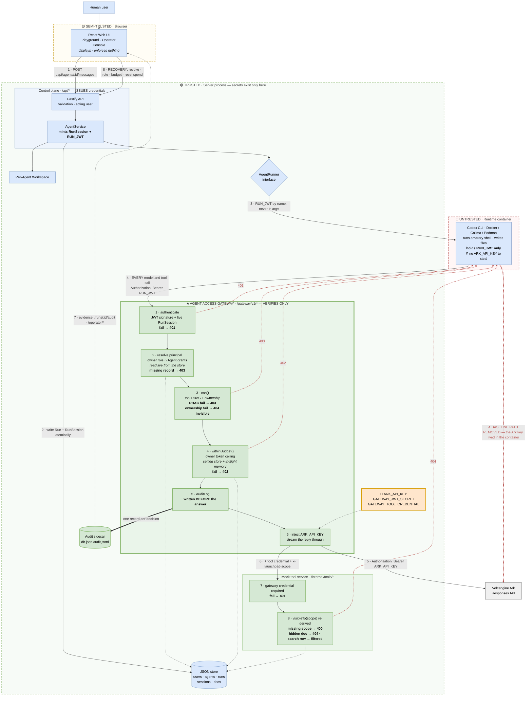

# Architecture Diagram

The hackathon deliverable: **the middleware, the data flow, the trust
boundaries, and the enforcement, instrumentation, and recovery points** on one
page.

The Starter Kit's baseline diagram left a single generic **"Team-Designed
Middleware"** node with three dotted `integrate` arrows into the Fastify API,
`AgentService`, and the `AgentRunner` interface. This diagram is that node filled
in. All three seams are genuinely used: the gateway mounts at the Fastify request
boundary, `AgentService` mints the run credential, and the runner's generated
`config.toml` is repointed at the gateway.

The baseline also drew the Agent Runtime calling **Volcengine Ark directly**.
That arrow required the Ark key to live inside the container, which is the
vulnerability this project removes. It appears below in red, struck through.

> **Colour key.** Blue is Starter Kit baseline, unchanged. **Green is
> team-designed middleware — everything new.** Orange is a server-held secret.
> Red is a denial or a removed path.

---

## The diagram



---

## Enforcement points

Every one is server-side. Every denial is decided **before** anything is
forwarded, so a refused call reaches no upstream and costs nothing.

| #   | Check                                                                   | Where                       | Denies with                    |
| --- | ----------------------------------------------------------------------- | --------------------------- | ------------------------------ |
| 1   | JWT signature, algorithm, expiry, **and** a live unrevoked `RunSession` | `gateway.ts` · `run-jwt.ts` | `401`                          |
| 2   | Principal resolved from the Agent's **current** owner and grants        | `gateway.ts`                | `403` if either record is gone |
| 3   | `can()` — owner role ∩ Agent grants ∩ resource visibility               | `authz.ts`                  | `403`                          |
| 4   | `withinBudget()` — settled + in-flight spend against the owner ceiling  | `budget.ts`                 | `402`                          |
| 7   | Call carries the gateway's tool credential                              | `mock-tools.ts`             | `401`                          |
| 8   | `visibleTo(scope)` re-derived independently downstream                  | `mock-tools.ts`             | `404`                          |

**Instrumentation** is point 5: `AuditLog` is the single writer, one redacted
record per decision, appended to the sidecar and awaited **before** the caller is
answered. No request or response body is ever stored.

**Recovery** is flow 8: revoke a run credential, change a role, cut a budget, or
reset spend. All four land on the Agent's **next gateway call**, because
permissions are read from the store per call and were never in the credential.

---

## Trust boundaries

| Boundary               | What crosses it                                              | What stops there                                                   |
| ---------------------- | ------------------------------------------------------------ | ------------------------------------------------------------------ |
| Browser → Server       | A **user id** (`x-launchpad-user`) and the shared demo token | Roles and permissions — the browser never asserts either           |
| Server → Runtime       | `RUN_JWT` — short-lived, revocable, **permission-free**      | **`ARK_API_KEY`. It never crosses.**                               |
| Runtime → Server       | Every model and tool call, bearing only `RUN_JWT`            | Anything unverifiable, unauthorized, or unaffordable               |
| Gateway → Tool service | The gateway's own credential + the authorized scope          | The agent's credential — nothing downstream can replay a run token |

> **There is no code path anywhere in this system where a client asserts a
> permission.** Clients assert _identity_; the server derives _authority_, from
> stored policy, on every call.

---

## In one paragraph

> The baseline routed the Agent Runtime directly to Ark, which required the API
> key inside a container that runs arbitrary shell commands. We replaced that
> path with the **Agent Access Gateway**: the agent holds only a short-lived,
> revocable, permission-free run credential and knows exactly one endpoint. Every
> model and tool call is authenticated against a live run session, authorized
> against the owner's current role intersected with the Agent's delegated grants
> and the resource's visibility, checked against the owner's token budget, and
> recorded — all before the real credential is attached server-side and the call
> is forwarded. Because permissions live in the store rather than in the token,
> revoking an agent, demoting a human, or cutting a budget takes effect on the
> very next call.

---

## Reproducing this diagram

A rendered copy is committed at [assets/architecture.pdf](assets/architecture.pdf),
one page, for reading away from a Markdown viewer.

The fenced Mermaid block above remains the single source — the PDF is generated
from it and is never edited directly. To regenerate after changing the block,
extract it to `architecture.mmd` and run:

```bash
npx -y @mermaid-js/mermaid-cli \
  -i architecture.mmd -o docs/assets/architecture.pdf --pdfFit -b white
```

`--pdfFit` is what keeps it to one page; `-b white` avoids a transparent
background that prints grey. Pasting the block into <https://mermaid.live>
exports the same thing by hand.
