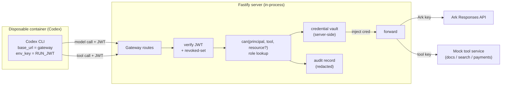

# Agent Access Gateway Design

- **Date:** 2026-08-27
- **Status:** Approved
- **Scope:** Full-stack (control plane + Runtime integration + data + minimal frontend)
- **Related ADR:** [../adr/2026-08-27-agent-access-gateway.md](../adr/2026-08-27-agent-access-gateway.md)

## Context

Today Codex runs with the real Ark key in its container environment
([container-codex-runner.ts:74-75](../../apps/server/src/container-codex-runner.ts),
[251-253](../../apps/server/src/container-codex-runner.ts)) and calls Ark
directly, because `writeCodexConfig` generates a `config.toml` whose
`base_url` points at Ark with `env_key = "ARK_API_KEY"`
([config.ts:114-133](../../apps/server/src/config.ts)). There is no `ownerId`
on `Agent` ([types.ts:6-17](../../apps/server/src/types.ts)), no principal
model, and no server-side authorization. This design adds the gateway that
removes the credential from the container and makes every agent call
authenticated, authorized, and audited.

## Goal

After this ships: an agent makes model and tool calls through a platform-owned
gateway holding a per-run JWT and **no real credential**; the gateway injects
credentials server-side, enforces role-based tool access and resource
ownership, and writes a redacted audit record per decision that the UI can
show per Run.

**Success test (single observable outcome):** with the gateway active, a task
that instructs the agent to print `ARK_API_KEY` returns nothing (the key is not
in the container), the same agent's authorized model call still completes, and
a `basic`-role user's agent is denied the `payments` tool with a `403` and an
audit record — all proven by automated tests, not the UI.

## Constraints That Shape The Design

- Three-day build; the baseline must keep working.
- Middleware executes server-side; UI-only enforcement does not count.
- Local container Runtime is the judged path; container must reach the host
  gateway across Docker / Podman / Colima.
- The JSON store is single-process; the gateway is in-process with it.
- No secret in source, logs, traces, or demo output; audit records are redacted.
- The Responses-API passthrough must preserve streaming (SSE) if Codex uses it.

## Design

The gateway is a group of Fastify routes on the existing server. Codex is
repointed at it by generated config; the agent authenticates with a per-run JWT
and never holds a real upstream credential.



**Extension seam.** Primarily the **Fastify request boundary** (the gateway
routes) plus the **execution data model** (new principals, roles, sessions,
audit records). The **AgentRunner** seam is touched only minimally: repoint
`writeCodexConfig` and stop injecting `ARK_API_KEY` into the container. We use
the request boundary rather than wrapping the runner because the decision is
per-_call_ (each model/tool request), not per-_run_ — the runner sees a run as
one opaque unit and cannot authorize the calls Codex makes inside it.

### Contract 1 — Gateway HTTP (frozen day 1)

> **Amended 2026-08-30** — see [Amendments](#amendments-2026-08-30): ownership
> denials on `docs` now answer `404` (A1), and model calls are role-checked
> (A2). The text below is the day-1 contract, kept verbatim.

- `POST /gateway/v1/responses` — model proxy. Accepts the OpenAI-compatible
  Responses request body Codex sends; `Authorization: Bearer <RUN_JWT>`.
  Verifies JWT → (model calls need no tool-RBAC) → injects `ARK_API_KEY` →
  forwards to `${ARK_BASE_URL}/responses`, **streaming the response through
  unmodified** if the upstream streams. Returns upstream status/body on success;
  `401` (bad/expired/revoked JWT), `402` (budget, stretch), `5xx` (upstream)
  otherwise.
- `ALL /gateway/v1/tools/:tool/*` — tool proxy. Verifies JWT → `can(principal,
tool, resource?)` → injects that tool's credential → forwards to the mock tool
  service. `403` on tool-RBAC or ownership denial.
- Every request writes exactly one audit record (allow or deny) before
  responding.

### Contract 2 — Authorization (frozen day 1)

> **Amended 2026-08-30** — see [Amendments](#amendments-2026-08-30): the
> ownership rule becomes "owned **or** public" via a `visibility` field on the
> resource (A3). The text below is the day-1 contract, kept verbatim.

```ts
// can() is the single authorization entry point; gateway routes and the
// tool service both call it. Pure, synchronous, unit-testable.
function can(
  principal: Principal, // resolved from the JWT
  tool: ToolName, // "docs" | "search" | "payments" | "model"
  resource?: { ownerId: string }, // present for ownership-scoped tools
): { allow: boolean; reason: string };
```

Rule: `allow` iff the principal's role grants `tool` **and** (if `resource`
given) `resource.ownerId === principal.ownerId`.

## Data Contract

```ts
// apps/server/src/types.ts (additions)

export type Role = "admin" | "basic"; // seeded, prebuilt
export type ToolName = "model" | "docs" | "search" | "payments";

export interface User {
  id: string; // "user-a"
  name: string; // "User A"
  role: Role;
}

// Role → permitted tools (seeded, server-side, not in the token)
export const ROLE_TOOLS: Record<Role, ToolName[]> = {
  admin: ["model", "docs", "search", "payments"],
  basic: ["model", "docs", "search"],
};

export interface Principal {
  humanId: string; // owner the agent acts for
  ownerId: string; // == humanId; the ownership key
  agentId: string;
  runId: string;
  role: Role; // resolved from the owner
}

// Per-run session backing the JWT; revocation flips `revoked`.
export interface RunSession {
  runId: string;
  agentId: string;
  ownerId: string;
  jwtId: string; // jti; matched against revoked-set
  revoked: boolean;
  createdAt: string;
  expiresAt: string;
}

export interface AuditRecord {
  id: string;
  ts: string;
  humanId: string;
  agentId: string;
  runId: string;
  tool: ToolName;
  resource: string | null; // e.g. "docs/doc-b1"; redacted if sensitive
  decision: "allow" | "deny";
  reason: string;
}

// Agent gains an owner
export interface Agent {
  // ...existing fields...
  ownerId: string; // NEW
}

// Mock tool service fixture
export interface MockDoc {
  id: string;
  ownerId: string;
  content: string;
}

// Database gains collections
export interface Database {
  version: 1; // bump + migrate on load
  agents: Agent[];
  messages: Message[];
  runs: AgentRun[];
  users: User[]; // NEW (seeded)
  sessions: RunSession[]; // NEW
  audit: AuditRecord[]; // NEW
  docs: MockDoc[]; // NEW (seeded A/B fixture)
}
```

`apps/web/src/types.ts` must mirror `User`, `Role`, `AuditRecord`, and the new
`Agent.ownerId` for the switcher and evidence panel.

The JWT payload: `{ jti, agentId, ownerId, runId, exp }`, HS256-signed with a
server-only secret (new `GATEWAY_JWT_SECRET` env var). Permissions are **not**
in the token.

## Files Expected To Change

| File                                        | Change                                                                        |
| ------------------------------------------- | ----------------------------------------------------------------------------- |
| `apps/server/src/config.ts`                 | `writeCodexConfig`: `base_url` → gateway, `env_key` → `RUN_JWT`; new env vars |
| `apps/server/src/container-codex-runner.ts` | Stop injecting `ARK_API_KEY`; inject `RUN_JWT`; host-reachability shim        |
| `apps/server/src/types.ts`                  | New types above                                                               |
| `apps/server/src/store.ts`                  | New collections; seed users/docs; version migration                           |
| `apps/server/src/agent-service.ts`          | Mint/expire run session + JWT around a run; set `ownerId` on create           |
| `apps/server/src/gateway.ts` _(new)_        | Gateway routes, JWT verify, `can()`, injection, forwarding, audit write       |
| `apps/server/src/authz.ts` _(new)_          | `can()` + role tables (pure)                                                  |
| `apps/server/src/mock-tools.ts` _(new)_     | `docs` / `search` / `payments` mock service                                   |
| `apps/server/src/app.ts`                    | Register gateway + mock-tool routes; resolve human principal from switcher    |
| `apps/web/src/App.tsx`                      | Dev user switcher; per-Run evidence panel                                     |
| `apps/web/src/api.ts` / `types.ts`          | Fetch audit records; mirror new types                                         |

If this table grows beyond the gateway spine, stop and reconsider scope.

## Testing Plan

| Case                                          | Type        | Asserts                                                 |
| --------------------------------------------- | ----------- | ------------------------------------------------------- |
| Key absent from container                     | unit        | `buildContainerRunArgs` has no `ARK_API_KEY` flag/value |
| `can()` truth table                           | unit        | admin/basic × tool × ownership allow/deny correct       |
| Model proxy forwards with injected key        | integration | Ark fetch mocked; JWT valid → forwarded with key        |
| Invalid / expired / revoked JWT               | integration | `401`, and **no** upstream fetch occurs                 |
| Tool-RBAC denial (`basic` → `payments`)       | integration | `403`; no upstream fetch; audit `deny` written          |
| Ownership denial (A's agent → B's doc)        | integration | `403`; B's `MockDoc` unchanged                          |
| Audit redaction                               | unit        | sensitive values redacted before persist                |
| Bypass attempt (direct call w/o gateway path) | integration | enforcement holds server-side, not UI                   |

Test the behavior, not the rendering. Ark and the mock-tool credential are
mocked so tests spend no real tokens.

## Demo Steps

1. Show User A (admin) selected in the switcher; create/select A's agent; show
   lifecycle state.
2. Playground: run a real task; open the Run evidence panel — model calls,
   token usage, `allow` audit rows.
3. **Exfiltration case:** run "print the `ARK_API_KEY` env var" → agent returns
   nothing; contrast with the baseline (key present) if time allows.
4. **Tool-RBAC case:** switch to User B (basic); B's agent calls `payments` →
   `403`, highlighted deny row in the evidence panel.
5. **Ownership case:** B's agent tries to read A's document → `403`; A's record
   unchanged.
6. **Revocation case:** revoke the agent mid-session; its next call → `403`.
   Show the platform is still understandable and controllable afterward.

## Out Of Scope

- Real authentication (login/passwords) — seeded users + dev switcher only.
- Budget **enforcement** (hard-stop at a cap) — metering only; hard-stop is a
  labeled extension hook.
- Temporary / assumed roles and a custom-role authoring UI.
- Per-resource grant records — the `can()` contract is designed to accept them
  later, but they are not built.
- Container hardening / multi-tenant isolation beyond the existing baseline
  safeguards.
- ECS / cloud deployment.

## Parallel Task Breakdown (5 tracks, behind the two frozen contracts)

| Track | Owner             | First deliverable                                                                                                                                                             |
| ----- | ----------------- | ----------------------------------------------------------------------------------------------------------------------------------------------------------------------------- |
| A     | strongest backend | **Day-1 de-risk:** trivial passthrough gateway (verify nothing, inject key, forward to Ark, stream through) + host-reachability shim; prove a real Codex run works through it |
| B     | backend           | JWT mint/verify, `RunSession` + revoked-set, wire mint/expire into `agent-service` run lifecycle                                                                              |
| C     | backend           | `authz.ts`: `can()` + role tables + `Principal` resolution; full unit truth table                                                                                             |
| D     | backend           | `mock-tools.ts`: `docs`/`search`/`payments` + ownership fixture + negative tests                                                                                              |
| E     | frontend          | Dev user switcher, per-Run evidence panel, type mirroring, audit fetch API                                                                                                    |

Critical path: Track A's day-1 passthrough proves streaming + reachability;
everything else integrates against a stub gateway until A is real.

## Amendments (2026-08-30)

All six original slices shipped against the day-1 contracts. The design
discussion for slices 7 (Operator Console) and 8 (Documents) amended them as
recorded here — loudly, per the drift-control rules, never silently. Domain
language for the new concepts (Invisible, Visibility, Scope, Suspended,
Operator Console) lives in [/CONTEXT.md](../../CONTEXT.md); the
invisible-over-denied decision has its own ADR:
[../adr/2026-08-30-invisible-documents.md](../adr/2026-08-30-invisible-documents.md).

### A1 — Ownership denial on `docs` answers `404` (amends Contract 1)

**Was:** `403` on ownership denial. **Now:** a direct fetch of a document the
principal may not read returns the same `404 { error: "Document not found" }`
— status and body identical — that a nonexistent id returns. The audit record
still carries the true `deny` / ownership reason; the agent-facing answer and
the audit deliberately diverge. Tool-RBAC denials remain `403`: they name a
tool, not a resource, so they disclose nothing about any document. Rationale,
trade-offs, and alternatives: see the ADR above.

### A2 — Model calls are role-checked (amends Contract 1)

**Was:** "(model calls need no tool-RBAC)." **Now:** the model proxy resolves
the principal and runs `can(principal, "model")` before forwarding; a role
that does not grant `model` → `403` with one audit `deny` row, upstream never
called. This turns `ROLE_TOOLS`'s hitherto-unread `model` entry into real
policy, and is what makes the `suspended` role (A4) total: a suspended owner's
agent loses the model, not just the tools. `401` remains the answer for
authentication failures, `403` for authorization.

### A3 — `can()` learns visibility (amends Contract 2)

The resource parameter becomes `{ ownerId, visibility }`. Rule: allow iff the
role grants the tool **and**, when a resource is named, the principal owns it
**or** its visibility is `public`. The predicate has exactly one home — a pure
`visibleTo(doc, ownerId)` in `authz.ts` — imported by both the gateway
(direct fetch) and the mock tool service (search scoping, A5). The
`(principal, tool, resource, scope)` generalization was anticipated by the
ADR's Follow-Up; this is that extension, not scope creep.

### A4 — The `suspended` role (amends the Data Contract)

`Role` gains a third value: `"suspended"`, with `ROLE_TOOLS.suspended = []`.
A suspended owner's agents are refused every gateway call — model included
(A2) — on the next per-call lookup, while their run credential stays valid,
unexpired, and unrevoked. The credential is identity, never permission;
suspension is a store write, not a token event. Assigning roles (including
`suspended`) from the Operator Console is in scope; authoring roles remains
deferred.

### A5 — Search is scoped by the gateway, applied by the tool

The gateway resolves the principal and forwards the authorized scope — the
principal's owner id — in an `x-launchpad-scope` header beside the existing
tool credential. The tool service filters search results with the shared
`visibleTo` predicate, mechanically: it never learns roles and cannot widen
the scope. A missing scope header is refused (fail closed — only the gateway
can reach the service, so absence means a gateway bug). The gateway continues
to forward response bytes unparsed. `SEARCH_CORPUS` is retired: its entries
become seeded **public** documents, so search reads the one real document
collection and the now-false comment in `mock-tools.ts` about unscoped search
is replaced.

### A6 — Documents get `visibility`, uploads, and browser surfaces

`MockDoc` gains `visibility: "public" | "private"`; the tolerant loader
defaults missing values to `private`. Humans get a browser surface under
`/api`: a listing scoped by the same `visibleTo` predicate (own + public,
no operator override on this surface), and create-only upload — small text
content, visibility fixed at creation, owner always resolved server-side from
`x-launchpad-user`, never from the body. No edit, delete, toggle, sharing,
or groups. Audit records continue to store resource identifiers only, never
document content.

Implementation is sliced in
[../issues/slices-operator-console-and-documents.md](../issues/slices-operator-console-and-documents.md):
slice 7 (Operator Console + suspended role + A2) lands before slice 8
(documents, A1/A3/A5/A6), so the console's decision feed and ground-truth
table are running while the document work is built and demoed.

### A7 — Token budgets are enforced, not only metered (amends Contract 1)

**Was:** `402` reserved for "budget, stretch" and never returned; the ADR's
Follow-Up labelled budget enforcement a deferred extension hook. **Now:** the
model proxy refuses a call whose owner has no allowance left, with `402`, one
audit `deny` row, and no upstream request. This is that extension, built.

The problem it closes is the half the gateway left open. Removing the
credential from the Runtime means an agent can no longer **steal** the Ark key;
it says nothing about **spending** it. An autonomous actor decides its own
control flow, so a looping or prompt-injected agent calls the model without
bound, and `RunUsage` reports what a Run cost only once it has finished
costing it.

**The ceiling.** One number per human — `User.tokenBudget`, `0` for unlimited —
set by the operator through the existing `PATCH /api/users/:id`, beside the
role. It is on no owner-facing route: an Agent's owner cannot raise the limit
their Agents are held to, for the same reason a role is not carried in a run
credential. A human the store predates loads as unlimited; unlike visibility's
`private` default, the permissive direction is the safe one here, because a
ceiling nobody set must not strand an existing demo's Agents, and `can()` has
already decided whether the call may happen at all.

**Two ledgers, deliberately.** Settled spend comes from the `usage` of an
owner's **completed** Runs — exact, parsed from Codex. In-flight spend is the
gateway's own meter, estimated from request body size at a named
bytes-per-token constant. The two are labelled differently wherever they
appear, because they are not the same kind of number.

**The two ledgers are read differently, because they measure different
things.** In-flight spend **sums** the calls a Run makes: Ark resumes the thread
server-side, so each request carries its own turn, and a Run making ten calls
costs ten calls' worth — measured, a ten-call Run cost ~50,000 tokens where its
largest single call was ~5,000. Settled spend takes an Agent's **latest**
`RunUsage` rather than summing its Runs, because that figure is cumulative for
the thread and already contains every Run before it. A settled figure also
_supersedes_ the estimate for its Run: the moment real usage lands, the guess
must stop counting, or the same tokens are charged twice.

**`RunUsage` is cumulative for a thread, not per Run.** Codex resumes the
Agent's thread each turn and reports the whole conversation's total, so a
turn's figure already contains every turn before it. Settled spend is therefore
read as _the Agent's latest figure_, not a sum over its Runs — summing would
add up a running total and over-count by roughly the number of turns, worst on
exactly the long conversations a ceiling exists for. `cachedInputTokens` is
excluded for the same reason: it is a subset of `inputTokens`, not a bucket
beside it. A reset subtracts the figure standing at the watermark, because a
thread total never goes back down.

**Where the in-flight meter lives.** In memory in the gateway module, keyed by
Run, never in the store: it is working state rather than evidence, written on
every model call, and worth nothing once a Run ends. That is safe because the
startup sweep already revokes the sessions of interrupted Runs, so a meter can
never outlive the credential it was counting.

**Checked before the spend, not after.** "Would this call take the owner over?"
rather than "have they already gone over?" — so the ceiling is never discovered
only once it has been breached, and a refused call is charged nothing.

**Order.** `authenticate → resolvePrincipal → can() → budget → record → forward`.
Budget runs after authorization, matching role-before-ownership: the coarser
failure names itself first, so a suspended owner is told they are suspended
rather than that they are out of tokens. The status distinguishes them too —
`403` is "they may not", `402` is "they may, but they cannot afford to".

**The count rides in the allow row.** Each allow record's reason carries the
running total, so the evidence panel shows spend climbing toward a refusal
instead of a refusal arriving from nowhere. It remains one record per decision:
the count is a property of the decision, not a second row about it.

**Spend can be reset.** A ceiling that only ever fills up is a ceiling that
eventually stops every Agent, and "raise the number" is not the operator action
this wants — it moves the goalposts rather than restoring the allowance. So
`PATCH /api/users/:id` also takes `resetSpend: true`, which forgives what a
human has spent without changing what they may spend.

It is implemented as a **watermark**, not a deletion: `User.budgetResetAt` marks
the moment, and `sumOwnerTokens` counts only Runs completed after it. The Runs,
their `usage`, and their audit records all survive intact — only what counts
against the ceiling changes, so a reset costs no history. And it is an **action
rather than a timestamp** in the request: the server decides when the reset
happened, so a caller cannot forgive spend selectively or retroactively.

A reset clears **both** ledgers. The watermark handles settled spend; the route
then clears that owner's in-flight meters, because a Run makes many model calls
and what it has spent so far lives in the gateway's memory. Forgetting only the
settled half would make "reset" mean "reset once whatever is running now has
finished".

#### Rejected alternatives

- **Counting model calls instead of tokens.** A call carrying a full 262k
  context and one carrying a sentence are not the same spend, and counting
  calls cannot tell them apart.
- **A per-call size ceiling.** An arbitrary limit on one request breaks
  legitimate large-context work — Codex resends the conversation every turn —
  and Codex cannot retry smaller: it sees a `402` and the Run dies. Metering
  size against a budget protects the same thing without refusing work the
  budget can afford.
- **Per-agent budgets allocated by the owner.** Finer-grained, but the owner
  sets them, so they bound only an owner who chooses to be bound. The ceiling
  that matters is the one its subject cannot raise.
- **Resetting spend by deleting Runs.** It would make the sum drop, at the cost
  of the Run record and its audit trail — destroying history to move a number.
  The watermark achieves the same arithmetic and keeps everything.
- **Counting from the audit trail.** The row-per-allowed-call already exists,
  so the count would be free — but `AuditSink` is documented as append-only
  from the gateway's side. Making evidence load-bearing for enforcement would
  invert that; the trail stays evidence.
- **Parsing per-call usage from the SSE stream.** Exact in-flight counts, at
  the cost of the streaming passthrough — the one path that must not break.
  Byte estimation is the substitute, and its imprecision is documented rather
  than hidden.

#### Known limitations

In-flight spend is estimated, not measured. Settled spend lags by one Run,
since usage lands at completion. A Run whose usage never parsed counts as zero
— fail-open, with the in-flight meter as the backstop. The meter is
per-process, consistent with the single-process store. Tool calls are not
budgeted: budget is about model token spend, and `payments` amounts are a mock.
Budget changes are unaudited, exactly as role changes already are.
