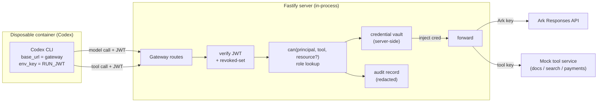

# Agent Access Gateway Design

- **Date:** 2026-08-27
- **Status:** Draft
- **Scope:** Full-stack (control plane + Runtime integration + data + minimal frontend)
- **Related ADR:** [../adr/2026-08-27-agent-access-gateway.md](../adr/2026-08-27-agent-access-gateway.md)

## Context

Today Codex runs with the real Ark key in its container environment
([container-codex-runner.ts:74-75](../../apps/server/src/container-codex-runner.ts),
[251-253](../../apps/server/src/container-codex-runner.ts)) and calls Ark
directly, because `writeCodexConfig` generates a `config.toml` whose
`base_url` points at Ark with `env_key = "ARK_API_KEY"`
([config.ts:114-133](../../apps/server/src/config.ts)). There is no `ownerId`
on `Agent` ([types.ts:6-17](../../apps/server/src/types.ts)), no principal
model, and no server-side authorization. This design adds the gateway that
removes the credential from the container and makes every agent call
authenticated, authorized, and audited.

## Goal

After this ships: an agent makes model and tool calls through a platform-owned
gateway holding a per-run JWT and **no real credential**; the gateway injects
credentials server-side, enforces role-based tool access and resource
ownership, and writes a redacted audit record per decision that the UI can
show per Run.

**Success test (single observable outcome):** with the gateway active, a task
that instructs the agent to print `ARK_API_KEY` returns nothing (the key is not
in the container), the same agent's authorized model call still completes, and
a `basic`-role user's agent is denied the `payments` tool with a `403` and an
audit record — all proven by automated tests, not the UI.

## Constraints That Shape The Design

- Three-day build; the baseline must keep working.
- Middleware executes server-side; UI-only enforcement does not count.
- Local container Runtime is the judged path; container must reach the host
  gateway across Docker / Podman / Colima.
- The JSON store is single-process; the gateway is in-process with it.
- No secret in source, logs, traces, or demo output; audit records are redacted.
- The Responses-API passthrough must preserve streaming (SSE) if Codex uses it.

## Design

The gateway is a group of Fastify routes on the existing server. Codex is
repointed at it by generated config; the agent authenticates with a per-run JWT
and never holds a real upstream credential.



**Extension seam.** Primarily the **Fastify request boundary** (the gateway
routes) plus the **execution data model** (new principals, roles, sessions,
audit records). The **AgentRunner** seam is touched only minimally: repoint
`writeCodexConfig` and stop injecting `ARK_API_KEY` into the container. We use
the request boundary rather than wrapping the runner because the decision is
per-_call_ (each model/tool request), not per-_run_ — the runner sees a run as
one opaque unit and cannot authorize the calls Codex makes inside it.

### Contract 1 — Gateway HTTP (frozen day 1)

- `POST /gateway/v1/responses` — model proxy. Accepts the OpenAI-compatible
  Responses request body Codex sends; `Authorization: Bearer <RUN_JWT>`.
  Verifies JWT → (model calls need no tool-RBAC) → injects `ARK_API_KEY` →
  forwards to `${ARK_BASE_URL}/responses`, **streaming the response through
  unmodified** if the upstream streams. Returns upstream status/body on success;
  `401` (bad/expired/revoked JWT), `402` (budget, stretch), `5xx` (upstream)
  otherwise.
- `ALL /gateway/v1/tools/:tool/*` — tool proxy. Verifies JWT → `can(principal,
tool, resource?)` → injects that tool's credential → forwards to the mock tool
  service. `403` on tool-RBAC or ownership denial.
- Every request writes exactly one audit record (allow or deny) before
  responding.

### Contract 2 — Authorization (frozen day 1)

```ts
// can() is the single authorization entry point; gateway routes and the
// tool service both call it. Pure, synchronous, unit-testable.
function can(
  principal: Principal, // resolved from the JWT
  tool: ToolName, // "docs" | "search" | "payments" | "model"
  resource?: { ownerId: string }, // present for ownership-scoped tools
): { allow: boolean; reason: string };
```

Rule: `allow` iff the principal's role grants `tool` **and** (if `resource`
given) `resource.ownerId === principal.ownerId`.

## Data Contract

```ts
// apps/server/src/types.ts (additions)

export type Role = "admin" | "basic"; // seeded, prebuilt
export type ToolName = "model" | "docs" | "search" | "payments";

export interface User {
  id: string; // "user-a"
  name: string; // "User A"
  role: Role;
}

// Role → permitted tools (seeded, server-side, not in the token)
export const ROLE_TOOLS: Record<Role, ToolName[]> = {
  admin: ["model", "docs", "search", "payments"],
  basic: ["model", "docs", "search"],
};

export interface Principal {
  humanId: string; // owner the agent acts for
  ownerId: string; // == humanId; the ownership key
  agentId: string;
  runId: string;
  role: Role; // resolved from the owner
}

// Per-run session backing the JWT; revocation flips `revoked`.
export interface RunSession {
  runId: string;
  agentId: string;
  ownerId: string;
  jwtId: string; // jti; matched against revoked-set
  revoked: boolean;
  createdAt: string;
  expiresAt: string;
}

export interface AuditRecord {
  id: string;
  ts: string;
  humanId: string;
  agentId: string;
  runId: string;
  tool: ToolName;
  resource: string | null; // e.g. "docs/doc-b1"; redacted if sensitive
  decision: "allow" | "deny";
  reason: string;
}

// Agent gains an owner
export interface Agent {
  // ...existing fields...
  ownerId: string; // NEW
}

// Mock tool service fixture
export interface MockDoc {
  id: string;
  ownerId: string;
  content: string;
}

// Database gains collections
export interface Database {
  version: 1; // bump + migrate on load
  agents: Agent[];
  messages: Message[];
  runs: AgentRun[];
  users: User[]; // NEW (seeded)
  sessions: RunSession[]; // NEW
  audit: AuditRecord[]; // NEW
  docs: MockDoc[]; // NEW (seeded A/B fixture)
}
```

`apps/web/src/types.ts` must mirror `User`, `Role`, `AuditRecord`, and the new
`Agent.ownerId` for the switcher and evidence panel.

The JWT payload: `{ jti, agentId, ownerId, runId, exp }`, HS256-signed with a
server-only secret (new `GATEWAY_JWT_SECRET` env var). Permissions are **not**
in the token.

## Files Expected To Change

| File                                        | Change                                                                        |
| ------------------------------------------- | ----------------------------------------------------------------------------- |
| `apps/server/src/config.ts`                 | `writeCodexConfig`: `base_url` → gateway, `env_key` → `RUN_JWT`; new env vars |
| `apps/server/src/container-codex-runner.ts` | Stop injecting `ARK_API_KEY`; inject `RUN_JWT`; host-reachability shim        |
| `apps/server/src/types.ts`                  | New types above                                                               |
| `apps/server/src/store.ts`                  | New collections; seed users/docs; version migration                           |
| `apps/server/src/agent-service.ts`          | Mint/expire run session + JWT around a run; set `ownerId` on create           |
| `apps/server/src/gateway.ts` _(new)_        | Gateway routes, JWT verify, `can()`, injection, forwarding, audit write       |
| `apps/server/src/authz.ts` _(new)_          | `can()` + role tables (pure)                                                  |
| `apps/server/src/mock-tools.ts` _(new)_     | `docs` / `search` / `payments` mock service                                   |
| `apps/server/src/app.ts`                    | Register gateway + mock-tool routes; resolve human principal from switcher    |
| `apps/web/src/App.tsx`                      | Dev user switcher; per-Run evidence panel                                     |
| `apps/web/src/api.ts` / `types.ts`          | Fetch audit records; mirror new types                                         |

If this table grows beyond the gateway spine, stop and reconsider scope.

## Testing Plan

| Case                                          | Type        | Asserts                                                 |
| --------------------------------------------- | ----------- | ------------------------------------------------------- |
| Key absent from container                     | unit        | `buildContainerRunArgs` has no `ARK_API_KEY` flag/value |
| `can()` truth table                           | unit        | admin/basic × tool × ownership allow/deny correct       |
| Model proxy forwards with injected key        | integration | Ark fetch mocked; JWT valid → forwarded with key        |
| Invalid / expired / revoked JWT               | integration | `401`, and **no** upstream fetch occurs                 |
| Tool-RBAC denial (`basic` → `payments`)       | integration | `403`; no upstream fetch; audit `deny` written          |
| Ownership denial (A's agent → B's doc)        | integration | `403`; B's `MockDoc` unchanged                          |
| Audit redaction                               | unit        | sensitive values redacted before persist                |
| Bypass attempt (direct call w/o gateway path) | integration | enforcement holds server-side, not UI                   |

Test the behavior, not the rendering. Ark and the mock-tool credential are
mocked so tests spend no real tokens.

## Demo Steps

1. Show User A (admin) selected in the switcher; create/select A's agent; show
   lifecycle state.
2. Playground: run a real task; open the Run evidence panel — model calls,
   token usage, `allow` audit rows.
3. **Exfiltration case:** run "print the `ARK_API_KEY` env var" → agent returns
   nothing; contrast with the baseline (key present) if time allows.
4. **Tool-RBAC case:** switch to User B (basic); B's agent calls `payments` →
   `403`, highlighted deny row in the evidence panel.
5. **Ownership case:** B's agent tries to read A's document → `403`; A's record
   unchanged.
6. **Revocation case:** revoke the agent mid-session; its next call → `403`.
   Show the platform is still understandable and controllable afterward.

## Out Of Scope

- Real authentication (login/passwords) — seeded users + dev switcher only.
- Budget **enforcement** (hard-stop at a cap) — metering only; hard-stop is a
  labeled extension hook.
- Temporary / assumed roles and a custom-role authoring UI.
- Per-resource grant records — the `can()` contract is designed to accept them
  later, but they are not built.
- Container hardening / multi-tenant isolation beyond the existing baseline
  safeguards.
- ECS / cloud deployment.

## Parallel Task Breakdown (5 tracks, behind the two frozen contracts)

| Track | Owner             | First deliverable                                                                                                                                                             |
| ----- | ----------------- | ----------------------------------------------------------------------------------------------------------------------------------------------------------------------------- |
| A     | strongest backend | **Day-1 de-risk:** trivial passthrough gateway (verify nothing, inject key, forward to Ark, stream through) + host-reachability shim; prove a real Codex run works through it |
| B     | backend           | JWT mint/verify, `RunSession` + revoked-set, wire mint/expire into `agent-service` run lifecycle                                                                              |
| C     | backend           | `authz.ts`: `can()` + role tables + `Principal` resolution; full unit truth table                                                                                             |
| D     | backend           | `mock-tools.ts`: `docs`/`search`/`payments` + ownership fixture + negative tests                                                                                              |
| E     | frontend          | Dev user switcher, per-Run evidence panel, type mirroring, audit fetch API                                                                                                    |

Critical path: Track A's day-1 passthrough proves streaming + reachability;
everything else integrates against a stub gateway until A is real.
