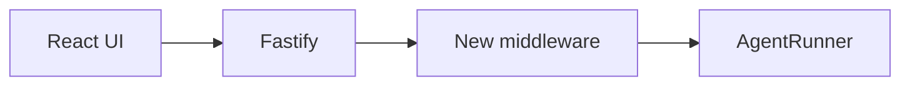

# <Feature Name> Design

- **Date:** YYYY-MM-DD
- **Status:** Draft | Approved | Implemented | Archived
- **Scope:** Control plane | Runtime | Data | Frontend | Full-stack
- **Related ADR:** [../adr/YYYY-MM-DD-decision.md](../adr/)

## Context

What exists today and why it is insufficient. Reference concrete files —
`apps/server/src/agent-service.ts:42` beats "the service layer".

## Goal

One paragraph. What is true after this ships that is not true now?

Define the success test explicitly: the single observable outcome that proves
this works.

## Constraints That Shape The Design

- Three-day build; the baseline must keep working.
- Middleware must execute server-side, not in the UI.
- Local container Runtime is the judged path.
- The JSON store is single-process.
- Add anything specific to this feature.

## Design

How it works. Include a diagram if the flow is non-obvious:



Name the extension seam used — request boundary, `AgentService`, `AgentRunner`,
or the execution data model — and why that one rather than the others.

## Data Contract

New or changed types, events, and persisted records. Give machine values, not
just display labels.

```ts
// apps/server/src/types.ts
```

Note whether `apps/web/src/types.ts` must be updated to match.

## Files Expected To Change

| File | Change |
| ---- | ------ |
|      |        |

If this table is long or heavily touches baseline files, reconsider the scope.

## Testing Plan

| Case                        | Type               | Asserts                    |
| --------------------------- | ------------------ | -------------------------- |
| Normal path                 | unit / integration |                            |
| Failure / denial / degraded | unit / integration |                            |
| Bypass attempt              | integration        | enforcement is server-side |

Test the behavior, not the rendering.

## Demo Steps

The three-minute live demo path, as numbered steps a teammate can rehearse.

1.
2.

## Out Of Scope

What this explicitly does not do. Protects against scope creep and gives the
"known limitations" section of the submission an honest answer.
